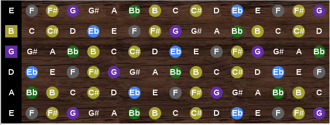

# lit-tar

#### Basic guitar:
```
<lit-tar></lit-tar>
```


#### Ukulele:
```
<lit-tar tuning='["G","C","E","A"]'></lit-tar>
```


#### Show a scale (E-flat minor):
```
<lit-tar key='Eb' highlight='[0,2,3,5,7,8,10]'></lit-tar>
```


